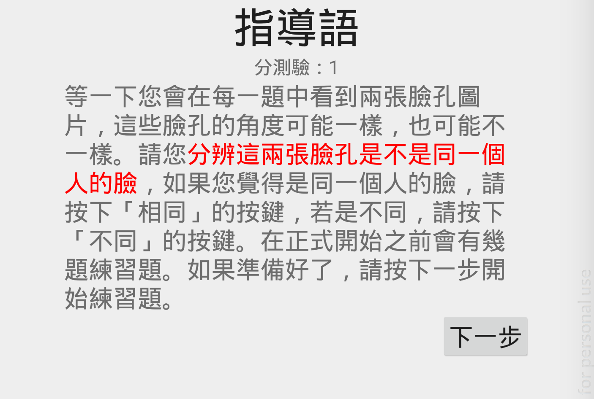
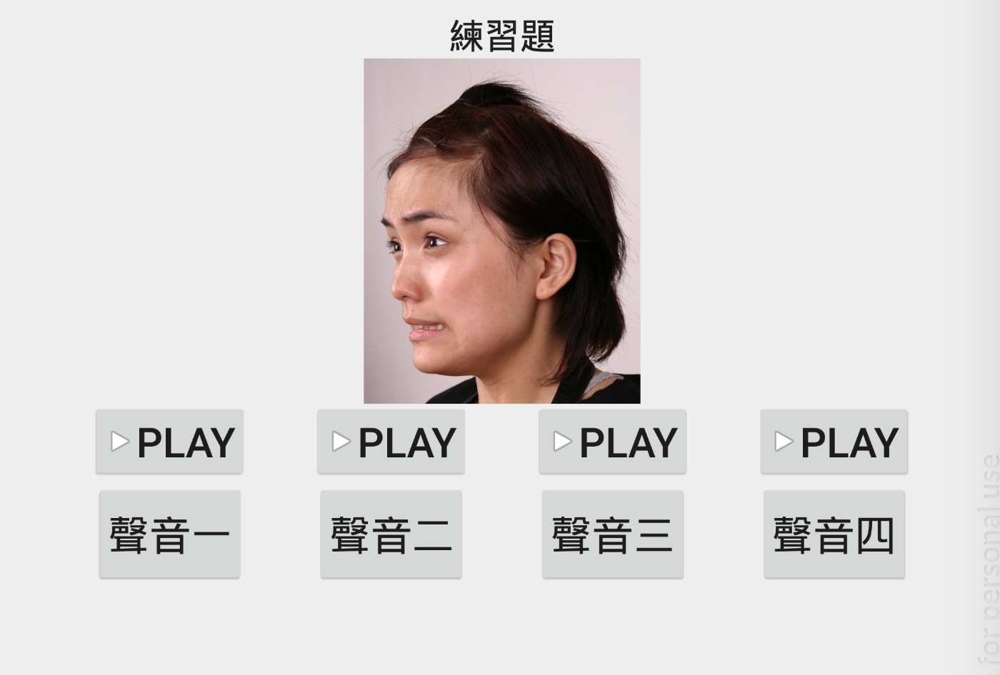

# EmotionRecognition-Android

    
    

This is an andoid App to test the ability of emotion recognition. Both the answer result and the answer time would be recorded by the app for the analysis.

* Skill: Activity Life Cycle, AlertDialog, MediaPlayer, opencsv library
